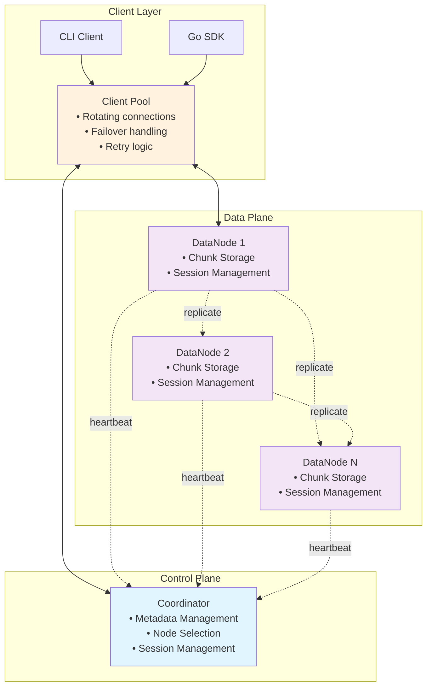

# Distributed File System (DFS) – Course Project Edition

DFS is a Go-based distributed file system for a course project submission. It demonstrates chunk-based storage, streaming gRPC replication, and metadata coordination.

> 📖 **Complete Documentation:** [System Design](docs/design.md) | [Architecture](docs/architecture.md) | [Protocol](docs/protocol.md) | [Configuration](docs/configuration.md) | [Development Roadmap](docs/roadmap.md)

---

## Table of Contents
1. [Features](#features)
2. [Prerequisites](#prerequisites)
3. [Quick Start](#quick-start)
4. [Architecture Overview](#architecture-overview)
5. [Configuration](#configuration)
6. [Project Structure](#project-structure)
7. [Development](#development)
8. [Testing](#testing)
9. [Documentation](#documentation)
10. [Roadmap](#roadmap)

---

## Features

### Core Functionality ✅
* **Upload/Download Operations**: Complete file transfer with chunking and parallel processing
* **Delete**: Implemented file deletion (with GC) and recursive directory listing APIs
* **Chunk-based Storage**: 8MB default chunks with configurable sizes up to 64MB
* **Data Replication**: Default factor of 3 (1 primary + 2 replicas) with parallel replication
* **Streaming Protocol**: Bidirectional (upload) and unidirectional (download) gRPC streams with back-pressure control and SHA-256 checksums
* **Node Management**: Automatic registration, heartbeat monitoring, and cluster state management
* **Resilient Client Connections**: Rotating client pool with automatic failover over multiple DataNodes
* **Session Management**: Two session types (streaming + metadata) ensuring operation atomicity

### Architecture Highlights
* **Coordinator Service**: Metadata-only service (file → chunk mapping, cluster membership)
* **Datanode Service**: Distributed storage nodes with peer-to-peer parallel replication
* **Client SDK**: Go SDK with parallel upload/download
* **Protocol Buffers**: Efficient serialization over gRPC (HTTP/2)
* **Docker Integration**: Full e2e test environment with 1 coordinator + 6 datanodes

### Planned Features 🚧
* **File Listing**: Clients must be able to list stored files
* **Persistent Metadata**: etcd-based (or similar) metadata storage (currently in-memory on coordinator)
* **Garbage Collection Cycles**: Partially implemented, require persistent metadata and testing
* **Observability**: Metrics, tracing, and operational monitoring
* **Enhanced Security**: TLS, JWT authentication, RBAC access control
* **Chunk encryption**: Chunk encryption storage options
* **API Gateway**: HTTP/REST interface with authentication and authorization

> **See Complete Feature List:** [docs/roadmap.md](docs/roadmap.md) | **Technical Details:** [docs/architecture.md](docs/architecture.md)

---

## Prerequisites

| Tool | Version | Purpose |
|------|---------|---------|
| **Go** | 1.24.4+ | Building binaries and running unit tests |
| **Docker** | Latest | Local multi-node cluster and e2e testing |
| **Protocol Buffers** | Latest | Required only when modifying `.proto` files |

### Development Tools (Optional)
```bash
# Install protobuf tools for gRPC development
make dev-setup
```

---

## Quick Start

### Launch Full Cluster
```bash
# Start 1 coordinator + 6 datanodes with e2e tests
make e2e
```

### Monitor and Manage
```bash
# View aggregated logs
tail -f ./logs/e2e_run.log

# Stop and cleanup
make e2e-down
```

### Development Workflow
```bash
# Run unit tests
make test

# Generate protobuf (after .proto changes)
make clean && make proto
```

> **Detailed Commands:** [PROJECT.mdc](PROJECT.mdc) | **Architecture Guide:** [docs/architecture.md](docs/architecture.md)

---

## Current Architecture Overview

### System Components



### Key Concepts
- **Chunks**: Files split into 8MB pieces with SHA-256 checksums
- **Replication**: Each chunk stored on N nodes with primary→replica streaming
- **Sessions**: Dual session management (streaming + metadata) for atomicity
- **Client Pool**: Rotating connections with failover and retry logic
- **Heartbeats**: 2-second intervals with incremental cluster state updates

### Protocol Flows

The system implements three main protocol flows:

#### Upload Flow
1. **Metadata Session**: Client → Coordinator creates upload session
2. **Streaming Sessions**: Client → Primary → Replicas with bidirectional streaming
3. **Metadata Commit**: Client confirms upload completion

#### Download Flow  
1. **File Metadata**: Client retrieves file info and chunk locations
2. **Chunk Downloads**: Client downloads chunks using server-side streaming
3. **File Assembly**: Client assembles chunks and verifies integrity

#### Delete Flow
1. **Soft Delete**: Coordinator marks file as deleted
2. **Chunk Cleanup**: Background GC processes remove chunks from storage
3. **Orphaned Cleanup**: Local GC scans clean up leftover chunks

> **Complete Architecture (including planned):** [docs/architecture.md](docs/architecture.md) | **Detailed Protocol Flows:** [docs/protocol.md](docs/protocol.md)

---

## Configuration

The system uses **environment variables** for service discovery and **YAML files** for operational configuration:

### Service Discovery (Environment Variables)
```bash
# Coordinator location (required by all nodes)
COORDINATOR_HOST=coordinator
COORDINATOR_PORT=8080

# New: global log level (default=error, dev=info)
LOG_LEVEL=info

# Node registration (required by datanodes)  
DATANODE_HOST=datanode1
DATANODE_PORT=8081
```

### Operational Settings (YAML Configuration)
```yaml
# configs/coordinator.yaml
coordinator:
  chunk_size: 8388608      # 8MB default
  metadata:
    commit_timeout: "5m"

# configs/datanode.yaml  
node:
  replication:
    timeout: "2m"
  session:
    timeout: "1m"
```

> **Complete Configuration Guide:** [docs/configuration.md](docs/configuration.md)

---

## Project Structure

```
dfs/
├── cmd/                   # Entry points
│   ├── coordinator/       # Coordinator service main
│   ├── datanode/          # DataNode service main
│   └── client/            # Client CLI main
├── internal/              # Private application code
│   ├── client/            # Client SDK (uploader, downloader)
│   ├── clients/           # gRPC client wrappers
│   ├── cluster/           # Node management & selection
│   ├── common/            # Shared types, proto -> internal type conversion & validation
│   ├── config/            # Configuration management
│   ├── coordinator/       # Coordinator business logic
│   ├── datanode/          # DataNode business logic
│   └── storage/           # Storage interfaces and implementations
│       ├── chunk/         # Chunk storage (disk-based)
│       ├── encoding/      # Serialization interface and protocol (protobuf)
│       └── metadata/      # Metadata storage (currently in-memory)
├── pkg/                   # Public library code
│   ├── proto/             # Generated protobuf files
│   ├── logging/           # Structured logging utilities
│   ├── streamer/          # Streaming utilities
│   ├── utils/             # General utilities, small functions, prototyping
│   ├── client_pool/       # Client connection pools (rotating etc.)
│   ├── testutils/         # Test utilities
├── tests/                 # Test files
│   └── e2e/              # End-to-end tests
├── configs/              # Example yaml configuration files
├── deploy/               # Deployment configurations
├── docs/                 # Documentation
└── logs/                 # Log output directory, local testing
```

> **Detailed Structure:** [PROJECT.mdc](PROJECT.mdc)

---

## Development

### Making Changes
```bash
# 1. Feature development
make test                   # Run unit tests
make e2e                    # Run full integration tests

# 2. Protocol changes
make clean && make proto    # Regenerate after .proto edits
make test                   # Verify changes
```

---

## Testing

### Test Coverage
- **Unit Tests**: `make test` - >80% coverage target with race detection
- **End-to-End**: `make e2e` - Full cluster scenarios with varying file sizes
- **Integration**: Component interaction testing

### Test Environment
```bash
# Local development
make test

# Full cluster simulation  
make e2e

# Continuous integration
# All tests run automatically on pull requests
```

### Debugging Tests
```bash
# Enable debug logging - modify in .env file
LOG_LEVEL=info # debug, info, warn, error
ENVIRONMENT=development # development, production
DEBUG_E2E_TESTS=false # true, false

# View specific logs
docker logs dfs_coordinator_1
docker logs dfs_datanode_1
```

> **Testing Strategy:** [docs/architecture.md#testing-infrastructure](docs/architecture.md)

---

## Documentation

### Complete Documentation Index

| Document | Purpose | Audience |
|----------|---------|----------|
| **[README.md](README.md)** | Project overview and quick start | All users |
| **[docs/design.md](docs/design.md)** | System design and future architecture | Architects, senior developers |
| **[docs/architecture.md](docs/architecture.md)** | Current implementation details | Developers, contributors |
| **[docs/protocol.md](docs/protocol.md)** | Wire protocol and API specifications | Protocol developers |
| **[docs/configuration.md](docs/configuration.md)** | Configuration reference and examples | Operators, DevOps |
| **[docs/roadmap.md](docs/roadmap.md)** | Development phases and feature planning | Project managers, stakeholders |
| **[PROJECT.mdc](PROJECT.mdc)** | Developer reference and AI assistant guide | Developers, AI tools |

### Quick Navigation
- **🚀 Getting Started**: [Prerequisites](#prerequisites) → [Quick Start](#quick-start)
- **🏗️ Understanding the System**: [Architecture Overview](#architecture-overview) → [docs/architecture.md](docs/architecture.md)
- **⚙️ Configuration**: [Configuration](#configuration) → [docs/configuration.md](docs/configuration.md)
- **🔧 Development**: [Development](#development) → [PROJECT.mdc](PROJECT.mdc)
- **📋 Planning**: [Roadmap](#roadmap) → [docs/roadmap.md](docs/roadmap.md)

---

## Roadmap

### Current Development Status
- ✅ **Phase 0**: Core file operations (upload/download) with replication
- 🚧 **Phase 1**: Missing file operations (delete/list) and persistent metadata
- 📋 **Phase 2**: Enhanced CLI and HTTP API gateway
- 📋 **Phase 3**: Security and authentication
- 📋 **Phase 4**: Performance optimization and scaling
- 📋 **Phase 5**: Observability and operations

### Immediate Next Steps
1. **Complete DeleteFile and ListFiles** operations
2. **Implement persistent metadata storage** (etcd integration)
3. **Add garbage collection** for orphaned chunks
4. **Enhanced CLI interface** with user-friendly commands

### Long-term Vision
- **Production-ready distributed file system** with enterprise features
- **Multi-cloud storage backends** (S3, GCS, Azure)
- **Advanced features**: Encryption, compression, deduplication
- **Operational excellence**: Monitoring, alerting, automated operations

> **Detailed Roadmap**: [docs/roadmap.md](docs/roadmap.md) | **Technical Planning**: [docs/design.md](docs/design.md)

---

## Contributing

* Discord communitity: [Go DFS](https://discord.gg/WrZKdMv3Q6)
* [Contribution guidelines](contributing.md):

## License

This project is licensed under the MIT License - see the [LICENSE](LICENSE) file for details.
